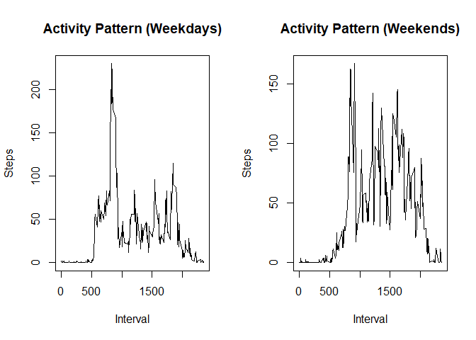

## Loading and preprocessing the data

```r
library(ggplot2)
library(plyr)
unzip("activity.zip",exdir = "data")
```


```r
activity <- read.csv("data/activity.csv", stringsAsFactors=FALSE)
str(activity)
```

```
## 'data.frame':	17568 obs. of  3 variables:
##  $ steps   : int  NA NA NA NA NA NA NA NA NA NA ...
##  $ date    : chr  "2012-10-01" "2012-10-01" "2012-10-01" "2012-10-01" ...
##  $ interval: int  0 5 10 15 20 25 30 35 40 45 ...
```

```r
summary(activity)
```

```
##      steps            date              interval     
##  Min.   :  0.00   Length:17568       Min.   :   0.0  
##  1st Qu.:  0.00   Class :character   1st Qu.: 588.8  
##  Median :  0.00   Mode  :character   Median :1177.5  
##  Mean   : 37.38                      Mean   :1177.5  
##  3rd Qu.: 12.00                      3rd Qu.:1766.2  
##  Max.   :806.00                      Max.   :2355.0  
##  NA's   :2304
```


##pulling data without nas

```r
activity$day <- weekdays(as.Date(activity$date))
activity$DateTime<- as.POSIXct(activity$date, format="%Y-%m-%d")

##pulling data without nas
clean <- activity[!is.na(activity$steps),]
head(activity$date)
```

```
## [1] "2012-10-01" "2012-10-01" "2012-10-01" "2012-10-01" "2012-10-01"
## [6] "2012-10-01"
```

```r
head(activity$day)
```

```
## [1] "Monday" "Monday" "Monday" "Monday" "Monday" "Monday"
```
## What is mean total number of steps taken per day?

```r
TotalStepsPerDay <- tapply(activity$steps, activity$date, sum)
hist(TotalStepsPerDay, xlab = "Number of Steps", main = "Histogram: Steps per Day")
```

<!-- -->
###Calculate and report the mean and median of the total number of steps taken per day

```r
meanStepsPerDay <-  mean(TotalStepsPerDay, na.rm = TRUE)
medianStepsPerDay <-  median(TotalStepsPerDay, na.rm = TRUE)
```


## What is the average daily activity pattern?
Make a time series plot (i.e. type = "l") of the 5-minute interval (x-axis) and the average number of steps taken, averaged across all days (y-axis)

```r
Interval <- tapply(activity$steps, activity$interval, mean, na.rm = TRUE)
plot(as.numeric(names(Interval)), 
     Interval, 
     xlab = "Interval", 
     ylab = "Steps", 
     main = "Average Activity Pattern", 
     type = "l")
```

<!-- -->
Which 5-minute interval, on average across all the days in the dataset, contains the maximum number of steps?

```r
maxInterval <- names(sort(Interval, decreasing = TRUE)[1])
maxSteps <- sort(Interval, decreasing = TRUE)[1]
```
## Imputing missing values
. Calculate and report the total number of missing values in the dataset (i.e. the total number of rows with NAs)

```r
missingvalues <- nrow(activity[is.na(activity$steps),])
```
. Devise a strategy for filling in all of the missing values in the dataset. The strategy does not need to be sophisticated. 
Using the mean for all the days

. Create a new dataset that is equal to the original dataset but with the missing data filled in.

```r
Interval <- tapply(activity$steps, activity$interval, mean, na.rm = TRUE)
# split activity data by interval
activity.split <- split(activity, activity$interval)
# fill in missing data for each interval
for(i in 1:length(activity.split)){
    activity.split[[i]]$steps[is.na(activity.split[[i]]$steps)] <- Interval[i]
}
activity.desciprtion <- do.call("rbind", activity.split)
activity.desciprtion <- activity.desciprtion[order(activity.desciprtion$date) ,]
```
. Make a histogram of the total number of steps taken each day and Calculate and report the mean and median total number of steps taken per day. Do these values differ from the estimates from the first part of the assignment? What is the impact of imputing missing data on the estimates of the total daily number of steps?


```r
TotalStepsPerDays <- tapply(activity.desciprtion$steps, activity.desciprtion$date, sum)
hist(TotalStepsPerDays, xlab = "Number of Steps", main = "Histogram: Steps per Day")
```

<!-- -->

```r
MeanPerDay.imputed <- mean(TotalStepsPerDays, na.rm = TRUE)
MedianPerDay.imputed <- median(TotalStepsPerDays, na.rm = TRUE)
```


## Are there differences in activity patterns between weekdays and weekends?

. Create a new factor variable in the dataset with two levels – “weekday” and “weekend” indicating whether a given date is a weekday or weekend day.

```r
activity.desciprtion$day <- ifelse(weekdays(as.Date(activity.desciprtion$date)) == "Saturday" | weekdays(as.Date(activity.desciprtion$date)) == "Sunday", "weekend", "weekday")
```
. Make a panel plot containing a time series plot (i.e.type = "l") of the 5-minute interval (x-axis) and the average number of steps taken, averaged across all weekday days or weekend days (y-axis). See the README file in the GitHub repository to see an example of what this plot should look like using simulated data.


```r
# Calculate average steps per interval for weekends
StepsPerInterval.weekend <- tapply(activity.desciprtion[activity.desciprtion$day == "weekend" ,]$steps, activity.desciprtion[activity.desciprtion$day == "weekend" ,]$interval, mean, na.rm = TRUE)

# Calculate average steps per interval for weekdays
StepsPerInterval.weekday <- tapply(activity.desciprtion[activity.desciprtion$day == "weekday" ,]$steps, activity.desciprtion[activity.desciprtion$day == "weekday" ,]$interval, mean, na.rm = TRUE)

# Set a 2 panel plot
par(mfrow=c(1,2))

# Plot weekday activity
plot(as.numeric(names(StepsPerInterval.weekday)), 
     StepsPerInterval.weekday, 
     xlab = "Interval", 
     ylab = "Steps", 
     main = "Activity Pattern (Weekdays)", 
     type = "l")

# Plot weekend activity
plot(as.numeric(names(StepsPerInterval.weekend)), 
     StepsPerInterval.weekend, 
     xlab = "Interval", 
     ylab = "Steps", 
     main = "Activity Pattern (Weekends)", 
     type = "l")
```

<!-- -->
